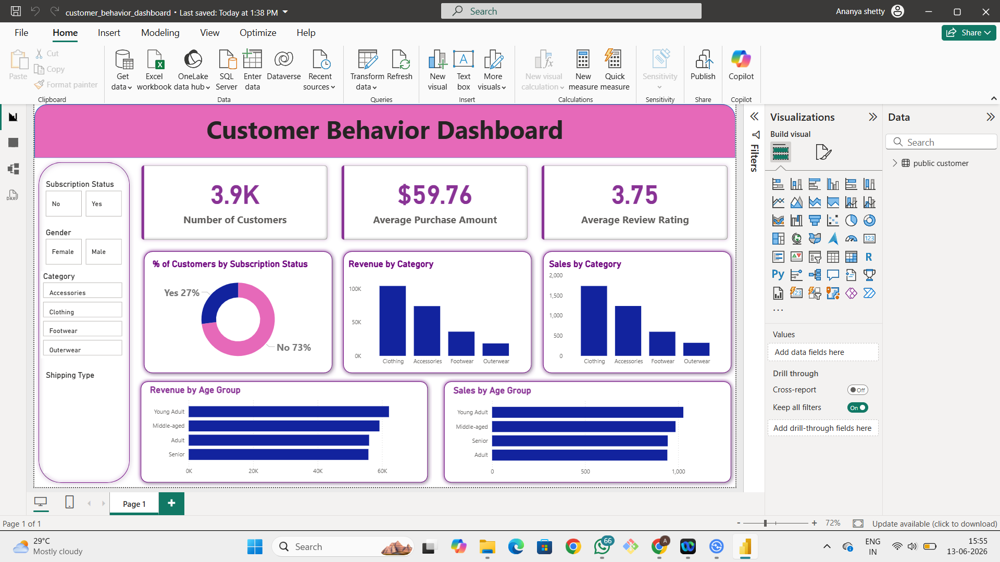

# 🛒 Customer Shopping Behavior Analysis Dashboard

## 📌 Project Overview

This project analyzes customer shopping behavior to identify purchasing patterns, spending trends, and customer preferences. The objective is to help businesses understand customer segments, optimize marketing strategies, and improve overall sales performance through data-driven decision-making.

---

## 🎯 Business Problem

Retail businesses generate large volumes of customer transaction data, but extracting actionable insights from this data can be challenging.

This project aims to answer key business questions such as:

* Which customer segments contribute the highest revenue?
* What product categories generate the most sales?
* How does spending vary across demographics?
* What factors influence customer purchasing behavior?
* Which customer groups should be targeted for marketing campaigns?

---

## 🛠️ Tools & Technologies

* Power BI
* SQL
* Microsoft Excel
* Data Cleaning & Transformation
* Data Visualization

---

## 📊 Dashboard Features

### Executive KPIs

* Total Customers
* Total Revenue
* Average Purchase Value
* Total Transactions

### Customer Analysis

* Spending by Gender
* Spending by Age Group
* Customer Distribution

### Product Analysis

* Top Performing Categories
* Category-wise Revenue Contribution
* Purchase Frequency Analysis

### Behavioral Insights

* Shopping Trends
* Customer Preferences
* Revenue Drivers

---

## 📸 Dashboard Preview

### Main Dashboard



---

## 🔍 Key Insights

* Customers aged 26–35 contributed the highest share of revenue.
* Electronics and Fashion categories generated the majority of sales.
* Female customers showed higher average spending compared to male customers.
* A small percentage of customers accounted for a significant portion of total revenue.
* Repeat customers contributed substantially to overall business performance.

---

## 💡 Business Recommendations

* Focus marketing campaigns on high-value customer segments.
* Promote top-performing product categories through targeted offers.
* Implement loyalty programs to increase customer retention.
* Use customer segmentation for personalized marketing strategies.
* Monitor purchasing trends regularly to optimize inventory planning.

---

## 📂 Project Structure

```text
Customer-Shopping-Behavior-Analysis/
│
├── Dataset/
├── SQL Queries/
├── Power BI Dashboard/
├── Images/
├── README.md
└── Customer_Shopping_Behavior.pbix
```

## 🚀 Project Outcome

The dashboard provides a comprehensive view of customer purchasing behavior, enabling stakeholders to make informed decisions regarding marketing, customer retention, and product strategy.

---

## 👩‍💻 Author

**Ananya R Shetty**

Aspiring Data Analyst 
